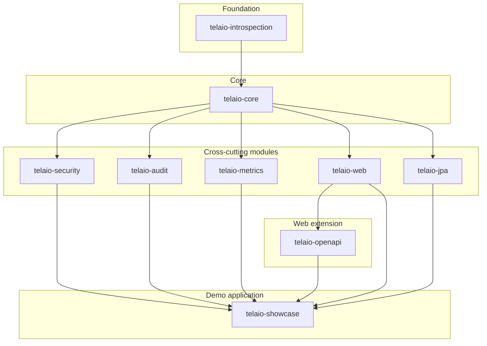

<p align="center">
  <picture>
    <source media="(prefers-color-scheme: dark)" srcset="docs/assets/logo-dark.svg">
    
  </picture>
</p>

<p align="center">
  <strong>A Spring Boot framework that turns your entities into secured, audited, metered REST APIs —
  no controllers, no DTOs.</strong>
</p>

<p align="center">
  
  
  
  
</p>

Telaio provides a unified **Data Access Layer (DAL)** abstraction for CRUD operations across
persistence backends. The core contract is **persistence-agnostic** — it is built on Spring Data's
abstractions (`Page`, `Pageable`, `Sort`) and knows nothing about any specific store;
**JPA/Hibernate is the first shipped backend**, with more (MongoDB, QueryDSL) on the roadmap.

Declare an entity, a repository, and one small service class annotated `@DalService`, and Telaio
generates a dynamic REST endpoint for it — with filtering, pagination, operation-level
authorization, field-level RBAC, structured audit logging, and performance metrics, all wired in
by auto-configuration.

```java
@DalService(name = "products")
public class ProductDalService extends JpaDal<Product, Long> {
}
```

`Product` is now a full CRUD REST resource at `/dal/v1/products` — no controller, no DTO, no
mapper. See the [Quick start](#quick-start) for the complete three-file example.

## Why Telaio

Most CRUD backends repeat the same ceremony for every resource: a controller, a DTO, a mapper, a
service, a repository. Telaio collapses that into one abstraction:

- **The entity is the API.** There is no DTO layer — the entity is read, written, and returned
  directly. What you model is what the client sees — though not necessarily under your field
  names (see [No DTOs — and no lock-in to your field names](#no-dtos--and-no-lock-in-to-your-field-names)).
- **Persistence-agnostic by design.** The `Dal` contract lives in `telaio-core` and depends only on
  Spring Data's paging/sorting abstractions; a backend implements a small `execute*` SPI. JPA is
  the first implementation — not a constraint of the architecture.
- **No controllers.** A single dynamic REST controller (`/dal/v1/{dalName}`) routes every DAL by
  name; you never write `@RestController` boilerplate for a resource.
- **Pluggable field-level RBAC.** Hide or lock fields per role via a small adapter
  (`PropertyBasedDalRbacAdapter`) or, for hierarchical roles, Jackson `@JsonView`
  (`JsonViewDalRbacAdapter`).
- **Operation-level authorization.** A `DalAuthAdapter` decides, per principal and per operation,
  whether create/read/update/delete is allowed — independent of RBAC's field filtering.
- **Exposure control without extra code.** `@DalService(internal = true)` keeps a DAL fully
  functional in-process while hiding it from REST and OpenAPI entirely; `@DalService(operations =
  {...})` exposes only a CRUD subset (e.g. read-only) and answers everything else with `404`/`405`.
- **Opt-in structured audit.** `@DalAudit` records every operation (principal, arguments, outcome,
  duration) as logfmt or JSON Lines, under a dedicated logger category, ready for log
  aggregation/SIEM ingestion.
- **Metrics on by default.** Every DAL is timed per operation (counts, error rate, latency
  percentiles) without any annotation; store it in memory, in a JDBC table, or forward it to
  Micrometer.
- **Auto-generated OpenAPI.** A concrete, per-DAL OpenAPI/Swagger document is synthesized from the
  entity and its exposure rules — no handwritten schema.

## No DTOs — and no lock-in to your field names

Skipping the DTO layer is a deliberate choice, not a shortcut. The classic DTO/mapper pair
duplicates every entity, and the copies drift: each new field must be declared twice and mapped
once more, and every mapping is one more place to be wrong. The three jobs a DTO actually does —
**rename** fields for the client, **hide** fields from the client, and **shape** a different
payload per audience — Telaio covers declaratively, on the entity itself:

**Rename with Jackson.** `@JsonProperty` (or a global `PropertyNamingStrategy`) decouples the wire
name from the Java attribute, and Telaio honors it end-to-end, not just in payloads (from the
showcase's `Product`):

```java
@JsonProperty("cost_price")
private BigDecimal costPrice;   // the client reads and writes "cost_price"
```

The renamed field works in filter queries (`q=cost_price>100`), is reported under its wire name in
RFC 9457 validation errors, and is documented under its wire name in the generated OpenAPI schema —
with `readOnly`/`writeOnly` derived from `@JsonProperty(access = ...)`, which also lets you add
derived, wire-only fields (a `@Transient` read-only `profit`, say) with no DTO in sight.

**Hide and shape with field-level RBAC.** Combine the renaming with a `DalRbacAdapter` and each
role receives a different **projection** of the same entity — what elsewhere costs one DTO per
audience:

- `PropertyBasedDalRbacAdapter` — declare per-role readable/writable field sets using type-safe
  Java property references (`propertyName(Product::getCostPrice)`); the translation to wire names
  is automatic. See `ProductRbacAdapter` in the showcase.
- `JsonViewDalRbacAdapter` — for hierarchical roles, tier the fields with Jackson `@JsonView` and
  map each role to a view. See `EmployeeRbacAdapter` in the showcase, where `USER` ⊂ `ADMIN` ⊂
  `DEVELOPER` see progressively wider projections (renamed fields like `employeeName` included).

Both strategies are covered in depth in the [security guide](docs/security-guide.md); filter-side
renaming is in the [REST API reference](docs/rest-api.md).

## Quick start

### 1. Add the dependencies

There is no single "starter" artifact — depend on the modules your project needs directly. At a
minimum you need `telaio-web` (REST exposure) and `telaio-jpa` (the first persistence backend of
the `Dal` abstraction, built on Spring Data JPA), plus a JDBC driver:

```xml
<dependency>
    <groupId>io.paganbit</groupId>
    <artifactId>telaio-web</artifactId>
    <version>0.0.1-SNAPSHOT</version>
</dependency>
<dependency>
    <groupId>io.paganbit</groupId>
    <artifactId>telaio-jpa</artifactId>
    <version>0.0.1-SNAPSHOT</version>
</dependency>
<!-- Optional cross-cutting modules -->
<dependency>
    <groupId>io.paganbit</groupId>
    <artifactId>telaio-security</artifactId>
    <version>0.0.1-SNAPSHOT</version>
</dependency>
<dependency>
    <groupId>io.paganbit</groupId>
    <artifactId>telaio-audit</artifactId>
    <version>0.0.1-SNAPSHOT</version>
</dependency>
<dependency>
    <groupId>io.paganbit</groupId>
    <artifactId>telaio-metrics</artifactId>
    <version>0.0.1-SNAPSHOT</version>
</dependency>
<dependency>
    <groupId>io.paganbit</groupId>
    <artifactId>telaio-openapi</artifactId>
    <version>0.0.1-SNAPSHOT</version>
</dependency>
```

Each module autoconfigures itself (`META-INF/spring/...AutoConfiguration.imports`) — no manual
`@Import`, no `@ComponentScan` to add.

### 2. Write an entity, a repository, and a `@DalService`

This is the full, real example shipped in `telaio-showcase`
(`AnnouncementDalService`) — a complete CRUD REST resource in three small files, with no security,
audit, or extra wiring:

**`Announcement.java`** (JPA entity):

```java
@Getter
@Setter
@NoArgsConstructor
@Entity
@Table(name = "announcements")
public class Announcement {

    @Id
    @GeneratedValue(strategy = GenerationType.IDENTITY)
    private Long id;

    @NotBlank
    @Column(nullable = false)
    private String title;

    @NotBlank
    @Column(columnDefinition = "TEXT", nullable = false)
    private String message;

    @NotNull
    @Enumerated(EnumType.STRING)
    @Column(nullable = false)
    private AnnouncementType type;

    @Column
    private LocalDateTime publishedAt;

    @Column
    private LocalDateTime expiresAt;
}
```

**`AnnouncementRepository.java`** (Spring Data JPA repository):

```java
public interface AnnouncementRepository extends JpaDalRepository<Announcement, Long> {
}
```

**`AnnouncementDalService.java`** (the DAL declaration):

```java
@DalService(name = "announcements")
@DalMetrics(enabled = false)
public class AnnouncementDalService extends JpaDal<Announcement, Long> {
}
```

That's it — no controller, no DTO, no mapper. `@DalMetrics(enabled = false)` is only there because
this particular example opts *out* of the metrics that are otherwise on by default. A DAL declared
without `@DalSecurity` is open at the DAL level (`PermitAll` authorization, no RBAC filtering);
authentication is still whatever your application's Spring Security configuration requires.

### 3. Call the generated REST API

Every DAL is served under `/dal/v1/{dalName}`. Against the showcase app (HTTP Basic, user
`developer`/`developer`):

```bash
# Create
curl -u developer:developer -X POST http://localhost:8080/dal/v1/announcements \
  -H "Content-Type: application/json" \
  -d '{"title":"Maintenance window","message":"Systems will be down for maintenance.","type":"WARNING"}'

# List, filtered and paged (Turkraft Spring Filter syntax in "q")
curl -u developer:developer "http://localhost:8080/dal/v1/announcements?q=type:'WARNING'&page=0&size=10"

# Read one by id
curl -u developer:developer http://localhost:8080/dal/v1/announcements/1
```

`PATCH /dal/v1/announcements/{id}` applies a partial update, `DELETE /dal/v1/announcements/{id}`
removes it. Errors follow RFC 9457 (`application/problem+json`). Entities with a composite key are
addressed by passing the key's JSON as a Base64 URL-safe `{id}` segment — see
[Composite IDs](docs/rest-api.md#composite-ids).

## Architecture at a glance



`telaio-introspection` is the reflection/type-utility foundation with no DAL dependency.
`telaio-core` defines the `Dal` contract, bean registration, and the channel-agnostic interceptor
SPI (`DalInterceptorProvider`) that audit and metrics build on — so both work with core alone, over
any invocation channel, not just REST. `telaio-security`, `telaio-audit`, `telaio-metrics`,
`telaio-web`, and `telaio-jpa` each depend only on core and are otherwise independent of each other;
`telaio-openapi` builds on `telaio-web` to generate per-DAL documentation. `telaio-jpa` is the
first backend implementation of the persistence-agnostic `Dal` contract — additional backends plug
into the same `execute*` SPI. `telaio-showcase` is a runnable demo application pulling in every
module.

## Module map

| Module                 | Purpose                                                              | Key type / annotation                                          | Docs                                                           |
|------------------------|----------------------------------------------------------------------|----------------------------------------------------------------|----------------------------------------------------------------|
| `telaio-introspection` | Reflection and type-introspection utilities shared by other modules. | `PropertyNameResolver`, `TypeUtil`                             | [docs/modules/introspection.md](docs/modules/introspection.md) |
| `telaio-core`          | The DAL abstraction, bean registration, and Spring Boot integration. | `Dal<E,I>` / `AbstractDal<E,I>`, `@DalService`                 | [docs/modules/core.md](docs/modules/core.md)                   |
| `telaio-security`      | Operation-level authorization and field-level RBAC.                  | `@DalSecurity`, `DalAuthAdapter`, `DalRbacAdapter`             | [docs/modules/security.md](docs/modules/security.md)           |
| `telaio-audit`         | Opt-in structured audit logging of DAL operations.                   | `@DalAudit`, `DalAuditEvent`, `DalAuditEventStore`             | [docs/modules/audit.md](docs/modules/audit.md)                 |
| `telaio-metrics`       | Per-DAL and per-operation usage/performance metrics, on by default.  | `@DalMetrics`, `DalMetricsAggregator`, `TelaioMetricsEndpoint` | [docs/modules/metrics.md](docs/modules/metrics.md)             |
| `telaio-web`           | Dynamic REST exposure of every registered DAL.                       | `DalRestApiV1Controller`, `@DalId`                             | [docs/modules/web.md](docs/modules/web.md)                     |
| `telaio-openapi`       | Generates concrete, per-DAL OpenAPI/Swagger documentation.           | `DalOpenApiCustomizer`, `DalPathsGenerator`                    | [docs/modules/openapi.md](docs/modules/openapi.md)             |
| `telaio-jpa`           | JPA/Hibernate `Dal` backend — the first persistence implementation.  | `JpaDal<E,I>`, `JpaDalRepository<E,I>`                         | [docs/modules/jpa.md](docs/modules/jpa.md)                     |
| `telaio-showcase`      | Runnable reference application exercising every module.              | `TelaioShowcaseApplication`                                    | [docs/modules/showcase.md](docs/modules/showcase.md)           |

## Roadmap

The DAL abstraction is persistence-agnostic by design, and cross-cutting features (audit, metrics,
security) already attach to the `Dal` bean independently of the invocation channel. Planned work
widens both sides of that contract:

- additional persistence backends (e.g. **MongoDB**);
- **QueryDSL** support as an alternative query technology;
- a **reactive exposure** (Spring WebFlux) as an alternative to the servlet REST boundary;
- further stores and query capabilities as the SPI matures.

## Requirements & build

- **Java 21+** — the Telaio library modules are compiled to, and distributed as, Java **21** bytecode.
  That is all you need to depend on Telaio.
- **Spring Boot 4.1.0**, **Jackson 3** (`tools.jackson.*`).

> **A note on Java 25:** `telaio-showcase` is a runnable demo (never published) and is the *only* module
> that targets Java **25**. Building or running the showcase therefore needs JDK 25+ — but that is a
> property of the demo app, **not** a requirement of the framework. Building the library modules on their
> own needs only JDK 21+.

```bash
mvn -pl telaio-core clean install       # build one library module (JDK 21+ is enough)
mvn clean install -DskipTests           # skip tests

mvn test                                # run all tests
mvn -pl telaio-core test                # run one module's tests

mvn -pl telaio-showcase spring-boot:run # run the demo app (needs JDK 25)
```

> A full reactor build (`mvn clean install` from the root) also compiles `telaio-showcase`, so it runs on
> JDK 25. To build only the library, target the library modules (e.g. `mvn -pl telaio-core clean install`)
> or exclude the demo with `mvn clean install -pl '!telaio-showcase'`.

The showcase starts on `http://localhost:8080` with Swagger UI at `/swagger-ui.html`. It
auto-starts a persistent PostgreSQL 17 container via `spring-boot-docker-compose` and seeds demo
data idempotently. Log in with HTTP Basic using one of the seeded test users: `developer` /
`developer`, `admin` / `admin`, or `user` / `user`.

## Documentation

This README is a facade. The full developer guide lives under [`docs/`](docs/README.md):

- [Getting started](docs/getting-started.md) — from an empty project to a running API.
- [Architecture](docs/architecture.md) — module layering, the request adapter chain, channel-agnostic
  interception, the DAL lifecycle.
- [REST API reference](docs/rest-api.md) — endpoints, the `q` filter language, pagination, error model.
- [Security guide](docs/security-guide.md) — authorization, RBAC strategies, exposure control.
- [Configuration reference](docs/configuration.md) — every `telaio.*` property.
- [Observability](docs/observability.md) — audit log formats and metrics storage/export options.
- Per-module deep dives in the [developer guide index](docs/README.md#module-documentation).

## Acknowledgments

Telaio's filter query language is powered by [**Turkraft Spring Filter**](https://github.com/turkraft/springfilter)
— an excellent library that parses a compact `q=` expression and turns it into a JPA `Specification`. The
expressive, type-safe filtering Telaio exposes on every read endpoint rests directly on their work. A special
thank-you to the Turkraft team and contributors for building and maintaining it.

## Commercial Support

Telaio is free and open source under the Apache License 2.0.

Commercial support is available for anybody that needs help with:

- production integration
- custom features
- migration support
- bug fixing
- security review
- architecture consulting
- long-term maintenance

For commercial support, contact: [marcopag90@gmail.com](mailto:marcopag90@gmail.com)

## Support the Project

If Telaio saves you time or is used in your company, consider sponsoring its development:
[**PayPal**](https://www.paypal.me/MarcoPag90).
Sponsorship helps fund maintenance, documentation, examples, bug fixing, and new features.

## License

Telaio is **free and open source**, licensed under the
[**Apache License, Version 2.0**](https://www.apache.org/licenses/LICENSE-2.0). You may use, modify,
and distribute it — including commercially — under the terms of the license.

See [`LICENSE`](LICENSE) for the full text.
